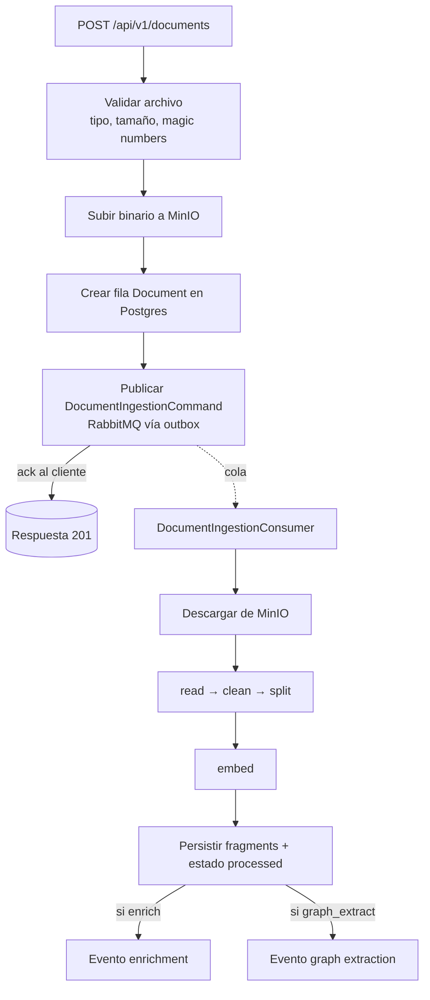

# AURA — Document Processing Service

Servicio FastAPI (Python 3.13) que ingiere documentos, los convierte en *fragments*
embebidos para búsqueda semántica/híbrida, y opcionalmente los enriquece y extrae un
grafo de conocimiento. Forma parte del backend **AURA** (monorepo `aura-backend`).

- **Framework:** FastAPI + Uvicorn
- **Arquitectura:** hexagonal / clean — `domain` ← `application` ← `infrastructure` / `api`
- **Persistencia:** PostgreSQL + pgvector (fragments), MinIO (binarios), Neo4j (grafo), Redis (locks/rate-limit), RabbitMQ (pipeline asíncrono)
- **Dependencias de servicio:** `aura-llm-service`, `aura-document-collection-service`, proveedor de autenticación

> La fuente canónica del contrato HTTP es el **OpenAPI** que expone la app en runtime
> (`/api/docs`, `/api/redoc`, `/api/openapi.json`). Ver también [`docs/api/`](docs/api/README.md).

---

## Índice

1. [Arquitectura y pipeline](#arquitectura-y-pipeline)
2. [Arranque rápido (Docker)](#arranque-rápido-docker)
3. [Arranque local (sin Docker)](#arranque-local-sin-docker)
4. [Variables de entorno](#variables-de-entorno)
5. [Tests, lint y tipado](#tests-lint-y-tipado)
6. [Observabilidad](#observabilidad)
7. [Endpoints operativos](#endpoints-operativos)
8. [Runbook de incidentes](#runbook-de-incidentes)
9. [Documentación adicional](#documentación-adicional)

---

## Arquitectura y pipeline

La creación de un documento es **síncrona hasta encolar** y luego el procesamiento
pesado ocurre **asíncrono** vía RabbitMQ (patrón outbox para publicar de forma fiable).



**Etapas del pipeline de ingesta** (en `document_ingestion_service`): `chunk` (read +
clean + split), `embed`, `persist`. Cada etapa está instrumentada con métricas (ver
[Observabilidad](#observabilidad)). Ante fallo en cualquier etapa el documento pasa a
estado `failed` y el mensaje va a dead-letter para reintento.

Estructura del código:

| Capa | Carpeta | Contenido |
|------|---------|-----------|
| Dominio | `app/domain` | entidades, DTOs, constantes, límites de campos |
| Aplicación | `app/application` | servicios de negocio, procesadores (readers/cleaners/splitters/embedders/rerankers) |
| Infraestructura | `app/infrastructure` | Postgres, Neo4j, MinIO, Redis, RabbitMQ, clientes HTTP (LLM, auth, catálogo) |
| API | `app/api` | controllers, dependencias (auth, rate limit), handlers de error |
| Configuración | `app/configuration` | settings de entorno, logging, métricas, middlewares |

---

## Arranque rápido (Docker)

Todo el stack vive en `aura-backend/docker/docker-compose/`. Desde la raíz del monorepo:

```bash
# 1. Infraestructura (Postgres, MinIO, Redis, RabbitMQ, Neo4j, ...)
docker compose -f docker/docker-compose/docker-compose-infrastructure.yml up -d

# 2. Servicios de aplicación (incluye este servicio en el puerto 8000)
docker compose -f docker/docker-compose/docker-compose-services.yml up -d

# (opcional) Observabilidad: Prometheus, Grafana, Elasticsearch, Filebeat, Phoenix
docker compose -f docker/docker-compose/docker-compose-observability.yml up -d
```

- El servicio se construye con [`Dockerfile`](Dockerfile) (CPU). Para GPU/CUDA usar
  [`DockerfileGPU`](DockerfileGPU) y el compose `docker-compose-services.gpu.yml`.
- La config se inyecta vía `env_file: .env.docker` (CPU) / `.env.docker.gpu` (GPU).
- El primer build descarga modelos HF/tiktoken (build pesado; `start_period` del
  healthcheck es de 600s). Verificá con:

```bash
curl http://localhost:8000/api/v1/health     # liveness
curl http://localhost:8000/api/v1/ready       # readiness (chequea DB/RabbitMQ/MinIO)
```

---

## Arranque local (sin Docker)

Requiere Python 3.13 y las dependencias de infraestructura accesibles (Postgres+pgvector,
Redis, RabbitMQ, MinIO, Neo4j) — lo más simple es levantar solo el compose de
infraestructura y correr la app desde el host.

```bash
# 1. Entorno e instalación (variante CPU)
python -m venv .venv && source .venv/bin/activate   # Windows: .venv\Scripts\activate
pip install -r requirements/requirements.txt -r requirements/requirements.test.txt

# 2. Configuración: pydantic-settings lee un .env en la raíz del servicio
cp env/.env .env        # ajustá hosts/credenciales según tu entorno local

# 3. Levantar la API
python -m app.main      # equivale a: uvicorn app.main:app --host $APP_HOST --port $APP_PORT
```

> Las clases de settings cargan `.env` desde el directorio de trabajo. En local copiá
> `env/.env` a `.env`; en Docker la config llega como variables de entorno del contenedor.

---

## Variables de entorno

La configuración se reparte en clases `*_settings.py` (pydantic-settings), cada una con
su **prefijo**. Los archivos de referencia son [`env/.env`](env/), [`env/.env.docker`](env/)
y [`env/.env.docker.gpu`](env/) — **no existe `.env.example`**; usá `env/.env.docker` como
plantilla. La fuente de verdad de cada variable es su clase de settings.

### Núcleo (obligatorias para arrancar)

| Variable | Descripción |
|----------|-------------|
| `APP_HOST`, `APP_PORT` | bind de la API (default `0.0.0.0:8000`) |
| `ENVIRONMENT` | `development` / `production` (en prod no se permite CORS `*`) |
| `LOG_LEVEL` | `DEBUG`/`INFO`/`WARNING`/`ERROR`/`CRITICAL` |
| `CORS_ORIGINS` | lista de orígenes permitidos |
| `REQUIRE_GPU` | si `true`, falla el arranque sin GPU |
| `DATABASE_MANAGER_HOST` `_PORT` `_USER` `_PASSWORD` `_NAME` `_DRIVER` | PostgreSQL + pgvector |
| `REDIS_CLIENT_URL` | Redis (locks de idempotencia, rate limiting) |
| `RABBITMQ_MANAGER_URL` | RabbitMQ (pipeline asíncrono) |
| `MINIO_MANAGER_ENDPOINT` `_ACCESS_KEY` `_SECRET_KEY` | almacenamiento de binarios |
| `NEO4J_MANAGER_URI` `_USER` `_PASSWORD` `_DATABASE` | grafo de conocimiento |
| `AUTHENTICATION_PROVIDER_AUTHENTICATION_URL` | validación de tokens (**requerida**) |
| `CHAT_SERVICE_MEMBERSHIP_URL` | verificación de membresía de chat |
| `DOCUMENT_COLLECTION_SERVICE_ACCESSIBLE_COLLECTIONS_URL` | resolución de docs accesibles |
| `LLM_PROVIDER_*_URL`, `LLM_PROVIDER_TIMEOUT_SECONDS` | endpoints del `aura-llm-service` |
| `KNOWLEDGE_GRAPH_ENABLED` | activa extracción de grafo |

### Rate limiting (configurable por entorno)

| Variable | Default | Descripción |
|----------|---------|-------------|
| `RATE_LIMIT_STRICT_RATE` | `20` | req/ventana en endpoints de escritura/costosos |
| `RATE_LIMIT_DEFAULT_RATE` | `60` | req/ventana en endpoints de lectura |
| `RATE_LIMIT_WINDOW_SECONDS` | `60` | tamaño de la ventana deslizante |
| `RATE_LIMIT_FAIL_OPEN` | `true` | si Redis no está disponible: `true` deja pasar, `false` responde 503 |

### Tuning del pipeline (opcionales, con defaults sensatos)

Agrupadas por prefijo — ver la clase de settings correspondiente para el detalle:

`CREATE_DOCUMENT_*`, `DOCUMENT_INGESTION_*`, `DOCUMENT_QUERY_*`, `DOCUMENT_SEARCH_*`,
`FRAGMENT_QUERY_*`, `READER_*`, `TEXT_CLEANER_*`, `TEXT_SPLITTER_*`, `EMBEDDER_*`,
`RERANKER_*`, `POST_PROCESS_DOCUMENT_*`, `POST_PROCESS_FRAGMENT_*`, `HTTP_CLIENT_*`,
`DOCUMENT_STORAGE_*`.

---

## Tests, lint y tipado

La suite corre **100% mockeada** (sin DB/Redis/RabbitMQ/MinIO reales) y es rápida:

```bash
pip install -r requirements/requirements.test.txt

pytest -q                                   # ~270 tests, < 10s
pytest -q --cov=app --cov-report=term-missing   # con cobertura (pytest-cov)

ruff check .                                # lint
mypy                                        # tipado (config en pyproject.toml)
```

`conftest.py` siembra la única variable requerida y mockea DB/servicios externos. La CI
(`.github/workflows/aura-document-processing-service.yml`) corre lint, mypy, pytest+cobertura,
resolución del lockfile, `pip-audit` y build de la imagen Docker.

---

## Observabilidad

### Métricas (Prometheus)

La app expone métricas en `GET /metrics`. Prometheus ya está configurado para *scrapear*
este servicio (ver `docker/observability/prometheus/prometheus.yml`). Además de la
instrumentación HTTP genérica, hay métricas de negocio:

| Métrica | Tipo | Qué mide |
|---------|------|----------|
| `aura_document_ingestion_total{result}` | counter | documentos ingeridos (success/failure) |
| `aura_document_ingestion_duration_seconds` | histogram | duración end-to-end de la ingesta |
| `aura_document_pipeline_stage_duration_seconds{stage}` | histogram | latencia por etapa (chunk/embed/persist) |
| `aura_document_pipeline_stage_failures_total{stage}` | counter | fallos por etapa (read/clean/split/embed/persist) |
| `aura_document_fragments_per_document` | histogram | fragments por documento |
| `aura_llm_request_duration_seconds{operation}` | histogram | latencia de llamadas al LLM por operación |
| `aura_llm_requests_total{operation,result}` | counter | resultado de llamadas al LLM |
| `aura_messages_consumed_total{queue,result}` | counter | throughput de colas (ack/nack/dropped) |
| `aura_message_processing_duration_seconds{queue}` | histogram | latencia de procesamiento por cola |

Hay un **dashboard de Grafana** provisionado en
`docker/observability/grafana/provisioning/dashboards/aura-document-processing.json`
(carpeta "AURA" en Grafana, `http://localhost:3001`, admin/admin).

### Logs

Logs estructurados a stdout; Filebeat los envía a Elasticsearch y se consultan desde
Grafana/Kibana. Se propaga un `request_id` por request para correlación.

---

## Endpoints operativos

| Endpoint | Propósito |
|----------|-----------|
| `GET /api/v1/health` | liveness (responde si el proceso está vivo) |
| `GET /api/v1/ready` | readiness (chequea DB, RabbitMQ y MinIO; 200 u 503) |
| `GET /metrics` | métricas Prometheus |
| `GET /api/docs`, `/api/redoc`, `/api/openapi.json` | documentación interactiva del API |

---

## Runbook de incidentes

| Síntoma | Causa probable | Acción |
|---------|----------------|--------|
| `/api/v1/ready` devuelve **503** | una dependencia (DB/RabbitMQ/MinIO) caída | revisar el cuerpo de la respuesta (indica qué dependencia falla) y el contenedor correspondiente |
| Documentos quedan en estado `uploaded`/no se procesan | consumer caído o cola sin drenar | revisar logs del servicio; mirar `aura_messages_consumed_total` y la cola en RabbitMQ (`http://localhost:15672`) |
| Muchos documentos en estado `failed` | fallo recurrente en una etapa | mirar `aura_document_pipeline_stage_failures_total{stage}` para aislar la etapa; revisar logs por `document_id` |
| Latencia alta de ingesta | etapa `embed`/`read` lenta (modelos en CPU, archivos grandes) | mirar `aura_document_pipeline_stage_duration_seconds{stage}`; considerar build GPU |
| Errores 5xx del LLM / timeouts | `aura-llm-service` degradado | mirar `aura_llm_requests_total{result}`; verificar `LLM_PROVIDER_*_URL` y el servicio LLM |
| **429** inesperados | rate limit muy bajo para el entorno | ajustar `RATE_LIMIT_*` (no requiere redeploy de código, solo cambiar env y reiniciar) |
| **503** del rate limiter | Redis caído con `RATE_LIMIT_FAIL_OPEN=false` | restaurar Redis, o setear `fail_open=true` si se prioriza disponibilidad |
| Mensajes descartados (`dropped`) | poison messages (body inválido/oversize/superó reintentos) | revisar logs; los mensajes van a dead-letter sin requeue |

---

## Documentación adicional

- [`docs/api/`](docs/api/README.md) — visión del API, autenticación, flujos de documentos
- [`docs/adapters/`](docs/adapters/) — readers, text cleaners, text splitters, embedders
- [`docs/embedding/`](docs/embedding/) — modelos de embedding (HuggingFace / Ollama)
- [`docs/splitting/`](docs/splitting/) — modelos de splitting (HuggingFace)
